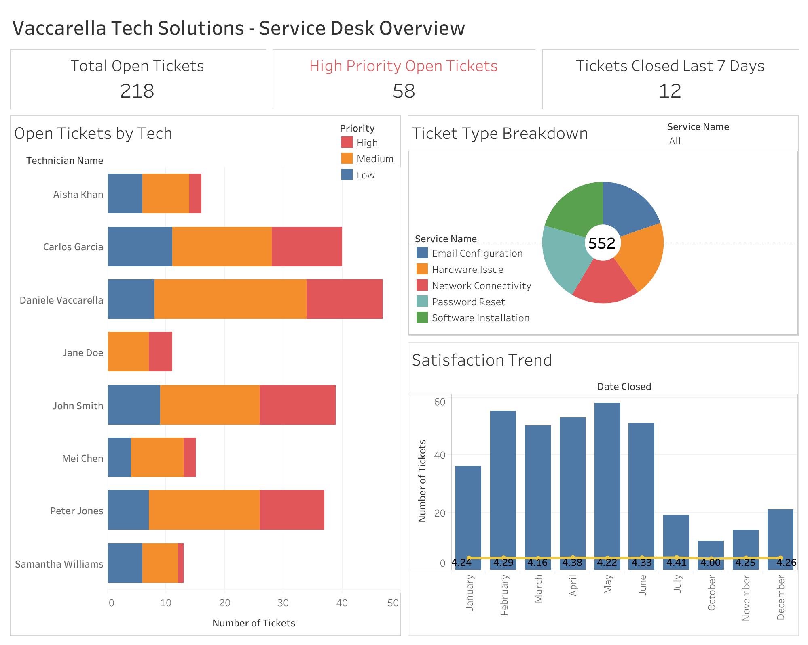

# IT Service Desk Performance Dashboard

### [View the Live, Interactive Dashboard on Tableau Public](https://public.tableau.com/app/profile/daniele.vaccarella/viz/VaccarellaTechDashboardServiceDesk/Dashboard1)

---

### Project Overview

I developed this project to demonstrate an end-to-end business intelligence solution focused on analyzing the operational performance of an IT service desk. The dashboard is built for a fictional company, "Vaccarella Tech Solutions," with the primary goal of enabling data-driven decision-making for management and individual technicians. The dashboard is designed to help leadership track high-performing team members and allow technicians to gauge their own performance.

The entire data pipeline was built from the ground up, starting with the creation of normalized data tables in CSV files. This was followed by data preparation and consolidation using SQL, and culminated in the development of a dynamic, interactive dashboard in Tableau.

---

### Tools & Technologies Used

The following tools were used to bring this project to life, in order of application:

*   **Excel:** For initial data modeling and the creation of the 5 source CSV files.
*   **DB Browser for SQLite:** For creating and managing the relational database.
*   **Visual Studio Code:** To author and execute the SQL query, and to export the final master dataset for Tableau.
*   **Tableau Public:** For data visualization and interactive dashboard development.

---

### Project Features

#### Data Engineering

*   **Relational Database:** Designed and built a relational database from scratch, consisting of 5 normalized tables (Tickets, Technicians, Services, Customers, Users) to ensure data integrity.
*   **Data Preparation with SQL:** Created a comprehensive SQL query using `LEFT JOIN` operations to consolidate all 5 tables. This created a clean, unified master dataset, ensuring that all ticket records were preserved for a complete analysis.

#### IT Dashboard (Business Intelligence)

*   **Dynamic KPIs:** The dashboard leads with key performance indicators, including Total Open Tickets, High-Priority Open Tickets, and Tickets Closed in the Last 7 Days, providing an at-a-glance summary of the current operational state.
*   **Technician Performance Analysis:** A central chart visualizes the current open workload for each technician, broken down by ticket priority. This allows for quick identification of workload balance and high-impact contributors.
*   **Interactive Filtering:** The dashboard is fully interactive. Clicking on a technician or using the global filters allows a manager or technician to dynamically drill down into the data to explore specific trends and performance metrics.
*   **Satisfaction & Trend Analysis:** A dual-axis chart tracks customer satisfaction scores against ticket volume over time, providing key insights into how workload and efficiency might impact customer perception.

---

### Dashboard Reasoning and Future Changes

*   **Workload Distribution:** The data reveals that certain technicians consistently manage a higher volume of high-priority tickets, which may be an indication for management to review the workload for each team member.

*   **Satisfaction Scores:** Some IT Technicians seem to be struggling in certain months with obtaining a high satisfaction score. For example, Peter Jones received a 2.00 average satisfaction score for the month of July, prompting a management review to determine the cause.

*   **Future Enhancements:**
    1.  Once I feel more comfortable with Python scripting, the next planned step for this dashboard is to create a Python script using the Pandas library to fully automate the ETL process. This would allow the dashboard to be refreshed on a daily schedule without manually pulling data from the database.
    2.  Additionally, I would like to migrate the database from the local SQLite file to a dedicated MySQL server. This would make the data pipeline more scalable and robust, simulating a true production environment where multiple applications might need access to the data.

---

### Repository Structure

*   **/data:** Contains all source `.csv` files used to populate the database, as well as the final `master_data.csv` exported from the SQL query.
*   **/sql:** Contains the master `.sql` file with the final, commented query used for data preparation.
*   **IT_Service_Desk.db:** The central SQLite database file containing all the raw, relational data.
